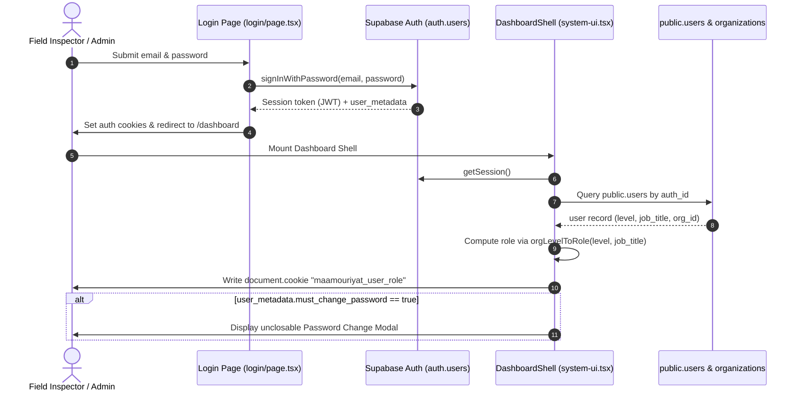
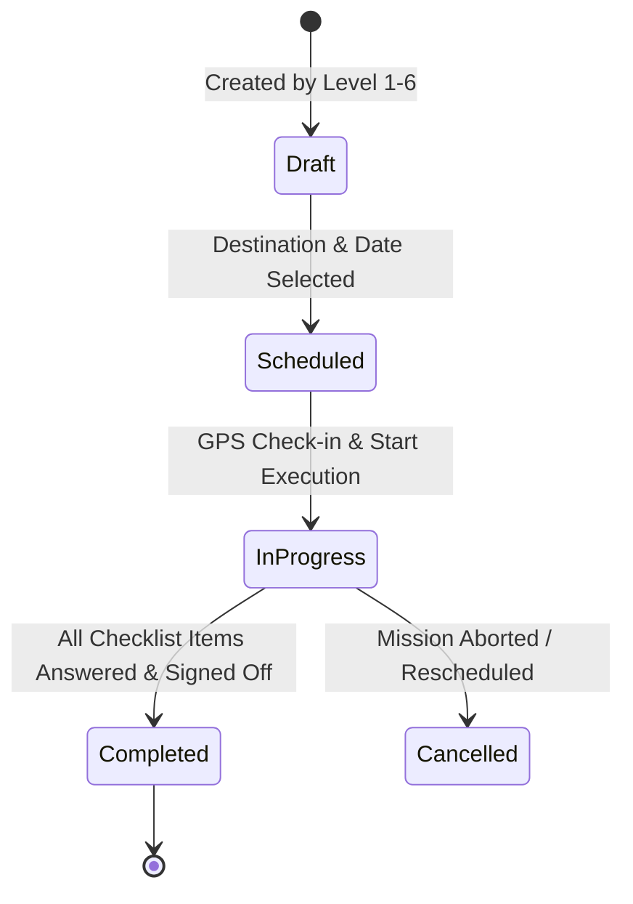
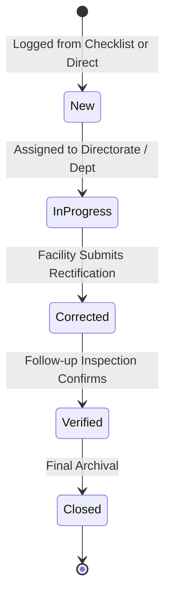
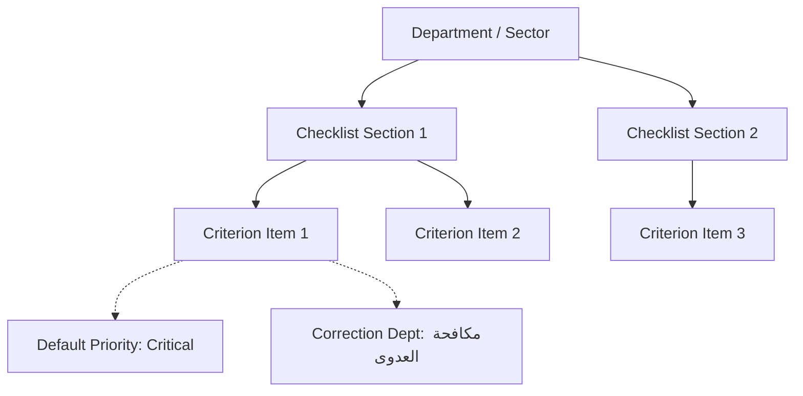

# Maamouriyat System — Workflows & Business Logic Inventory

> **Document Status**: Complete & Authoritative  
> **Phase**: Phase 0 — Inventory & Freeze  
> **Date**: September 2026  
> **Target System**: Maamouriyat Monitoring & Inspection System (Egyptian Ministry of Health & Population)

---

## Executive Summary

This document maps all business workflows, state transitions, mathematical formulas, and data flow pipelines currently implemented across the Maamouriyat codebase. It documents both the intended business rules and the existing code realities (including legacy workarounds, client-side vulnerabilities, and data serialization quirks).

---

## 1. Authentication & Password Change Lifecycle

### 1.1 Login & Session Initialization


### 1.2 `must_change_password` Enforcement Workflow
1. **Trigger Condition**:
   - When an administrator creates a new user via `/api/admin/create-user` or resets a password via `/api/admin/reset-password`, the user record is provisioned with:
     ```json
     { "user_metadata": { "must_change_password": true } }
     ```
2. **Detection**:
   - Client-side in `src/app/system-ui.tsx` (lines 428–430):
     ```typescript
     if (user.user_metadata?.must_change_password === true) {
       setMustChangePassword(true)
     }
     ```
3. **Execution**:
   - The user is blocked from accessing any dashboard tabs. An unclosable modal prompts for `new_password` and `confirm_password` (minimum 8 characters).
   - Form posts to `/api/user/change-password`:
     - Verifies active session token.
     - Calls `supabaseAdmin.auth.admin.updateUserById(user.id, { password, user_metadata: { must_change_password: false } })`.
     - Returns `{ success: true }`.
4. **Weakness / Flaw in V1**:
   - The enforcement is strictly client-side within `system-ui.tsx`. An attacker or knowledgeable user can bypass the React modal using DevTools or by invoking API routes directly because API endpoints do not verify the `must_change_password` flag before processing requests.

---

## 2. User Lifecycle & Organizational Scoping

### 2.1 Organizational Levels & Role Deduction
The system implements a 7-tier organizational structure defined in `src/lib/roles.ts` and `src/lib/organizations.ts`:

| Level | Code | Arabic Label | Deduced Role (`orgLevelToRole`) | Geographic / Scope Boundary |
|:---:|:---|:---|:---|:---|
| **0** | `TECH` | دعم فني | `techadmin` | Global system-wide maintenance |
| **1** | `MINISTRY` | ديوان عام الوزارة | `superadmin` | National (All 27 Governorates) |
| **2** | `SECTOR` | قطاع مركزي | `sector` | National for Sector-affiliated directorates/facilities |
| **3** | `CENTRAL_ADMIN`| إدارة مركزية | `central` | National scope within administrative specialty |
| **4** | `GENERAL_ADMIN`| إدارة عامة | `generalmanager` | National scope within specific departmental domain |
| **5** | `DIRECTORATE` | مديرية شئون صحية | `directorate` | Single Governorate (e.g., Cairo, Alexandria, Asyut) |
| **6** | `HEALTH_ADMIN` | إدارة صحية | `creator` (or `inspector` if job title contains "مفتش") | Single District / Health Administration |
| **7** | `UNIT` | وحدة / ميداني | `inspector` | Field execution only |

### 2.2 Scoping & Parent-Child Filtering Rules
1. **User Creation Restrictions** (`getAllowedOrgsForUserCreation`):
   - **Level 1 (Ministry)**: Can provision users at any level across any organization in the Republic.
   - **Level 2 (Sector)**: Can only provision users within its own sector organization (`sector_id === user.sector_id` or `id === user.sector_id`).
   - **Levels 3–7**: Blocked from user creation (`return []`).
2. **Current Known Scope Leakage Bug**:
   - In `system-ui.tsx` and `users-management.tsx`, when an administrator selects a parent organization, children organizations are loaded via an un-scoped fetch. In certain UI paths, a Sector Head (Level 2) selecting "ديوان الوزارة" accidentally views or selects entities outside their assigned sector. V2 must enforce strict server-side scoping on all organization queries.

---

## 3. Mission Lifecycle & Execution Workflow



### 3.1 Step-by-Step Mission Phases

#### Phase 1: Planning & Assignment (`missions-portal.tsx`)
- **Creator Eligibility**: Restricted to levels 1 through 6 (`canCreateMissions(level) === true`). Field inspectors (Level 7) cannot create missions.
- **Payload Parameters**:
  - `serial_number`: Formatted string `MAM-YYYYMMDD-XXXX`.
  - `destination_type`: `'facility'` (Hospital / PHC / Center) or `'governorate'` (Directorate / Regional office).
  - `target_facility_id` / `target_governorate_id`.
  - `department`: Sector or administrative department conducting the inspection.
  - `scheduled_date` & `estimated_duration`.
  - `inspectors`: Array of assigned inspector UUIDs.

#### Phase 2: On-Site GPS Check-in (`mission-execution-form.tsx`)
1. **Geolocation Capture**:
   - Inspector triggers `captureInspectorGPS()`.
   - Attempts `navigator.geolocation.getCurrentPosition` with `{ enableHighAccuracy: true, timeout: 12000 }`.
   - Fallback to `{ enableHighAccuracy: false }` if indoor/network-only.
2. **Haversine Distance Calculation**:
   - Compares inspector coordinates `(lat1, lon1)` with registered facility coordinates `(lat2, lon2)`:
     $$d = 2R \cdot \arcsin\left(\sqrt{\sin^2\left(\frac{\Delta\phi}{2}\right) + \cos(\phi_1)\cos(\phi_2)\sin^2\left(\frac{\Delta\lambda}{2}\right)}\right)$$
     where $R = 6371000\text{ meters}$.
   - If distance $> 500\text{m}$, the UI alerts the user of proximity divergence but does not hard-block execution (to accommodate GPS drift in dense urban environments).
3. **Destination Alteration**:
   - If the inspector visits a facility different from the scheduled destination:
     - `destination_changed = true`.
     - `actual_facility_id` is updated.
     - `change_reason` is **mandatory** (enforced by form validation).
4. **On-The-Fly Facility Registration**:
   - If visiting an unlisted clinic or facility:
     - Allows dynamic registration (`facilities.insert()`) with live coordinates, creating an ad-hoc facility record tagged `'تم تسجيلها أثناء المرور الميداني'`.

#### Phase 3: Checklist Evaluation & Scoring
- Inspector goes through section-by-section criteria.
- Answers: `compliant` (`yes` / `مطابق`), `non_compliant` (`no` / `غير مطابق`), or `not_applicable` (`n/a`).
- Marking an item `non_compliant` triggers:
  - Immediate prompt to input violation description.
  - Auto-assignment of the violation priority (`low`, `medium`, `high`, `critical`) from the template.
  - Designated correction department (`correction_dept`).
  - Photographic evidence capture with client-side compression (`browser-image-compression` to $< 1.5\text{MB}$).

#### Phase 4: Finalization & Sign-off
- **Mandatory Requirements for Status = `'completed'`**:
  1. 100% of checklist items must be answered (`validateChecklistCompletion()`).
  2. Recommendations and decisions field (`recommendations`) must not be empty.
  3. All detected violations must have an assigned correction unit.
- **Draft Save**:
  - Inspector can save with `status: 'in_progress'` at any time to resume later.

---

## 4. Results Evaluation & Compliance Scoring Formula

### 4.1 Mathematical Formulation
The compliance scoring engine in `mission-execution-form.tsx` (lines 589–600) executes the following evaluation:

$$\text{Total Criteria} = N_{\text{answered}} = N_{\text{compliant}} + N_{\text{non\_compliant}}$$

$$\text{Compliance Rate (\%)} = \begin{cases} 
\text{round}\left(\frac{N_{\text{compliant}}}{N_{\text{answered}}} \times 100\right), & \text{if } N_{\text{answered}} > 0 \\
0, & \text{otherwise}
\end{cases}$$

### 4.2 Legacy Result Storage Architecture (`api/missions/results/route.ts`)
Due to schema evolution during early V1 development, checklist item IDs are packed into the `notes` column:
- Format: `__item_id__:<uuid>` or `__static_id__:<string>`.
- Payload structure stored in `mission_results`:
  - `mission_id`: UUID
  - `question`: Arabic title of the criterion
  - `compliance_status`: `'compliant' | 'non_compliant' | 'not_applicable'`
  - `notes`: Contains packed ID + user inspector observations.
  - `severity_level`: `'low' | 'medium' | 'high' | 'critical'`
- **V2 Refactoring Requirement**: V2 must eliminate string packing and use a foreign key `checklist_item_id` referencing a normalized `checklist_items` table.

---

## 5. Violations Tracking & Rectification Lifecycle



### 5.1 Violation Attributes
- **Priority Tiers**:
  - `critical` (حرجة للغاية): Threatens patient life, non-functional oxygen/emergency generator, biohazard disposal breach. Immediate escalation.
  - `high` (خطورة عالية): Medicine storage temperature breach, missing autoclave biological indicators. 48–72 hours deadline.
  - `medium` (خطورة متوسطة): Shortage of sanitizers, administrative protocol failures. 7 days deadline.
  - `low` (مخالفة بسيطة): Ledger recording errors, minor maintenance defects. 14 days deadline.
- **Workflow Transitions**:
  1. `new` (جديدة ورصدت للتو): Newly submitted from a completed or in-progress mission.
  2. `in_progress` (جاري معالجتها): Action plan initiated by the corrective department (`assigned_to_dept`).
  3. `corrected` (تم التصحيح ميدانياً): Facility submits proof of rectification.
  4. `verified` (تم التحقق والاعتماد): Verification inspection validates correction.
  5. `closed` (مغلقة كلياً): Approved by Directorate or Sector General Manager.

### 5.2 Reporting & Arabic-Compliant Export
- Filterable by Governorate, Facility, Priority, and Status.
- **Excel/CSV Export**: Employs UTF-8 Byte Order Mark (`\uFEFF`) prepended to the blob stream to ensure Excel on Windows correctly decodes Arabic characters without corruption.

---

## 6. Targets Management & Aggregation Workflow

### 6.1 Target Levels & Dimensions
1. **Leadership Targets (`leadership_targets`)**:
   - Established by Ministry Leadership for Sectors and Central Administrations.
   - Metrics: Planned inspection count per month/quarter, minimum coverage percentage across governorates.
2. **Operational Mission Targets (`mission_targets`)**:
   - Assigned to Governorates, Health Directorates, and individual field inspection teams.
   - Periodic quotas: Weekly target, Monthly target.

### 6.2 Target vs. Actual Calculation Engine
- **Actual Completed Missions**:
  $$\text{Actual} = \sum \text{missions where } \text{organization\_id} = \text{TargetOrg} \land \text{status} = \text{'completed'} \land \text{date} \in [\text{PeriodStart}, \text{PeriodEnd}]$$
- **Achievement Ratio**:
  $$\text{Achievement Rate (\%)} = \min\left(100, \text{round}\left(\frac{\text{Actual}}{\text{Target}} \times 100\right)\right)$$

### 6.3 Critical V1 Architecture Flaw & Database Reality
- `/api/admin/mission-targets` and `/api/admin/leadership-targets` currently write to:
  - `src/data/mission-targets.json`
  - `src/data/leadership-targets.json`
- Using Node.js `fs.writeFileSync`. This fails in serverless/container production and violates transactional integrity.
- **Database Status**:
  - `public.leadership_targets` **already exists** in `scripts/14-leadership-targets.sql`. V2 must bind to this existing schema rather than creating duplicate tables.
  - `mission_targets` does not yet exist as a PostgreSQL table and must be designed in Phase 3.
  - Both routes suffer from critical **Fail-Open** defaults (`callerLevel = 1`, and unauthenticated `POST`/`DELETE` in leadership targets) which must be resolved to **Fail-Closed** in V2.

---

## 7. Checklists Template & Customization System

### 7.1 Template Structure


### 7.2 Static Defaults vs. Database Tables
- **Static Catalog** (`src/lib/checklist-data.ts`):
  - Provides pre-configured templates for 3 core departments:
    1. إدارة مكافحة العدوى (Infection Control)
    2. إدارة الصيدلة والمستلزمات (Pharmacy & Medical Supplies)
    3. إدارة صيانة الأجهزة الطبية (Medical Device Maintenance)
- **Database Tables** (`checklists`, `checklist_sections`, `checklist_items`):
  - Created in migration `13_checklists.sql`.
  - Managed via `/dashboard/checklists` and `/api/admin/checklists`.
  - Enables custom checklist authoring with configurable priorities, mandatory flags, and ordering.
- **Immutability & History Preservation**:
  - In V1, modifying a checklist template could distort historical inspections if results relied on live template references. V2 must snapshot or version checklist templates so completed missions remain historically immutable.

---

## 8. Summary of Workflow Dependencies for V2

| Workflow | V1 Bottleneck / Risk | V2 Solution Requirement |
|:---|:---|:---|
| **Auth & Password Change** | Handled in client React state; API unprotected | Server-side Next.js middleware + Route Handler auth validation |
| **User Scoping** | Organizations filtered in client arrays | Recursive SQL CTEs (`parent_id`) with server-side RLS |
| **Mission Execution** | 3,653-line monolithic form (`mission-execution-form.tsx`) | Modular multi-step wizard using HeroUI v3 & React Hook Form |
| **Result Storage** | String packing `__item_id__` in `notes` column | Normalized `checklist_item_id` foreign key relations |
| **Target Storage** | Local filesystem JSON writes (`fs.writeFileSync`) | Dedicated PostgreSQL tables (`leadership_targets`, `mission_targets`) |
| **Offline Missions** | Unreliable LocalStorage sync in `system-ui.tsx` | IndexedDB with Service Worker sync adapter |
